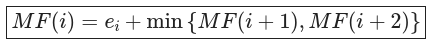
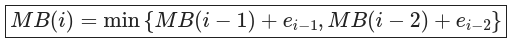

# About
This course material has been developed initially to be offered by the school of Computer Science in Nile University, Egypt, to students interested in solving problems. The course audience is quite diverse: Engineering, Computer Science, and Biomedical Informatics majors. Most of the students are either seniors or juniors. It covers the principles of *analysis and design of algorithms* to solve problems. Besides, I have been tutoring it for around 3 years, after developing the material.

# Philosophy
In these kind of courses, there are two common apporahces:
1. mention *many common algorithms* that could be used in solving different problems
2. **focus on the design principles** to solve unseen problems: designing solutions from scratch.

The courses is quite hybrid of the two, but with a primary focus on the second theme, most of the times. Therefore, for the tasks or assignments, it is crucial for the students to have enough time thinking about the solution themselves before getting feedback to learn from it.

## Language Choice
The course is mainly designed in **Python**. The reason for such choice is to **remove the language burden**, and only focus on the algorithmic thinking. We do not want the student to focus so much on the pointers, OOP, or any other programming principle while thinking how to solve problems. Of course, language can be changed to any other language like **C++** if the students are quite familiar with it.

# Motivation
This section is for students who might want to check out the material. The course focuses on both **analysis of algorithms** and **design of algorithms**. Below is some points covered through the course:

- Learning what is meant by algorithm analysis
- Learning the variants of **algorithm analysis**: both empirical and theoretical
- Covering the principles of using proofs to verify some findings about our algorithm
- Learning to **design recursive functions**, and modeling them into recurrence equations if possible
- Learning how to analyze recursive algorithms
- Learning how to optimize recursive algorithms through the **Dynamic Programming** principles
- Covering some common **Graph Search** algorithms: weighted and unweighted
- How to use search algorithms to solve optimization problems
- Techniques to optimize graph algorithms and how to **design heuristics**
- The principle of sub-optimality and trade-off between performance vs correctness in **Greedy algorithms**

## Samples
Honestly, for me, the course is quite funny and amazing in different persepctives. One funny thing is that I enjoy **designing recurrence equations that solve optimization problems**. Hence, I hope you as well enjoy having an equation, which we design together, that solves a **real-world problem**. For example, in module 5, we design the different recurrence equations where all are solving the same problems:

Not only that they are solving the same problem, but we can get performance enhancement via some modifications. Besides, another interesting thing for me is **adjusting the problems** to be seen as graph problem and designing heuristics to optimize them. In brief, I really enjoy these topics, and I hope you do so as well.

# Prerequisites
I presume that the students have sufficient knowledge in the below topics
- programming
- discrete mathematics
- data structures and asymptotic notations  

NOTE: I briefly iterate over the topics I need from discrete and asymptotic notations in Module 2

# Course Structure
The course is organized into Modules as below:

| **Module Number** |                    **Topics**                   |                 **Prerequisites**                |
|:-----------------:|:-----------------------------------------------:|:------------------------------------------------:|
|         1         | [Introduction to Analysis and Empirical Analysis](https://github.com/ammarSherif/Analysis-and-Design-of-Algorithms-Tutorials/blob/main/Module%2001:%20Empirical%20Analysis/Module%2001:%20Empirical%20Analysis.ipynb) |                         -                        |
|         2         |   [Theoretical analysis and correctness proofs](https://github.com/ammarSherif/Analysis-and-Design-of-Algorithms-Tutorials/blob/main/Module%2002:%20Introduction%20to%20Theoretical%20Analysis/Module%2002:%20Introduction%20to%20Theoretical%20Analysis.pdf)   |                         -                        |
|         3         |   [Design and analysis of recursive algorithms](https://github.com/ammarSherif/Analysis-and-Design-of-Algorithms-Tutorials/blob/main/Module%2003:%20Divide%20and%20Conquer/Module%2003:%20Divide%20and%20Conquer.ipynb)   | Knowledge from Induction proof in Module 2 should be helpful |
|         4         |    [Graph algorithms and search space pruning](https://github.com/ammarSherif/Analysis-and-Design-of-Algorithms-Tutorials/blob/main/Module%2004:%20Graph%20Algorithms/Module%2004:%20Graph%20Algorithms.pdf)    |                         -                        |
|         5         |               [Dynamic Programming](https://github.com/ammarSherif/Analysis-and-Design-of-Algorithms-Tutorials/blob/main/Module%2005:%20Dynamic%20Programming/Module%2005:%20Dynamic%20Programming.ipynb)               |                     Module 3                     |
|         6         |       Greedy algorithms and sub-optimality      |                     Module 6                     |

While teaching the course, we also host some private contests on codeforces to give more practice to the students on each module.

# References
Each module has its references mentioned, but I mostly use the below references:
- [Introduction to Algorithms by Cormen, Leiserson, Rivest and Stein](https://mitpress.mit.edu/books/introduction-algorithms-third-edition)
- [Artificial Intelligence: a modern approach by Russell and Norvig](https://www.pearson.com/us/higher-education/product/Russell-Artificial-Intelligence-A-Modern-Approach-3rd-Edition/9780136042594.html) In Module 4, in particular.

# What's next?
After finishing the course, I believe you have different paths according to the students' preferences:
1. You should have more practicing via the online judges
2. You might want to checkout **parallel algorithms** in multi-threaded or parallel computing platforms along with their design issues like synchoronization
3. You can check extra courses in the topic of **discrete optimization**, which relies heavily on algorithms
4. Check out advanced data structures
5. Checkout some application-specific algorithms: optimization algorithms, cryptographic algorithms, ... etc

# Contacts
- Github Repo: [Analysis and Design of Algorithms](https://github.com/ammarSherif/Analysis-and-Design-of-Algorithms-Tutorials)
- Email: ammarsherif90 [at] gmail [dot] com